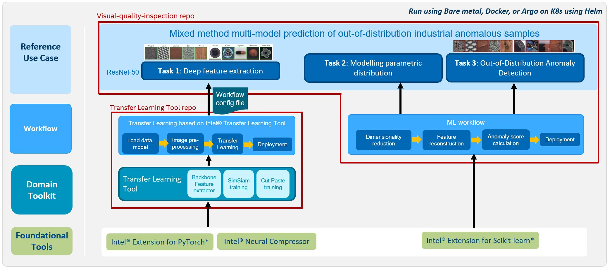

# Intel’s Visual Quality Inspection Reference Kit
## Blueprint
This blueprint is a one click refkit to provide an end-to-end solution on how 
to provide AI-powered visual quality inspection on the high resolution input images by identifing rare, abnormal events such as defects in a part being manufactured on an industrial production line. Use this reference solution as-is on your dataset, curate it to your needs by fine-tuning the models and changing configurations to get improved performance, modify it to meet your productivity and performance goals by making use of the modular architecture and realize superior performance using the Intel optimized software packages and libraries for Intel hardware that are built into the solution.


## Flow
1. Click on Use Blueprint button.
2. You will be redirected to your blueprint flow page.
3. Go to the project settings section and update the configuration or leave as default to check on built-in demo. To change the dir_url in first task allows you to try with other datasources.
4. Click on the Run Flow button.
5. The system will automatically connect with the provided dataset, train a pytorch base model, extract features from trained torch model and train a PCA model, providing an end-to-end visual quality inspection solution to provide .
6. Expected output is finetuned pytorch model, PCA model and scores on test dataset. Scores.csv file outlines anomaly score, threshold, final prediction for each test images.

## Solution Technical Overview
Classic and modern anomaly detection techniques have certain challenges: 
- Feature engineering needs to be performed to extract representations from the raw data. Traditional ML techniques rely on hand-crafted features that may not always generalize well to other settings. 
- Classification techniques require labeled training data, which is challenging because anomalies are typically rare occurrences and obtaining it increases the data collection & annotation effort. 
- Nature of anomalies can be arbitrary and unknown where failures or defects occur for a variety of unpredictable reasons, hence it may not be possible to predict the type of anomaly.

To overcome these challenges and achieve state-of-the-art performance, we present an unsupervised, mixed method end-to-end fine-tuning & inference reference solution for anomaly detection where a model of normality is learned from defect-free data in an unsupervised manner, and deviations from the models are flagged as anomalies. This reference use case is accelerated by Intel optimized software and is built upon easy-to-use Intel Transfer Learning Tool APIs.

### DataSet
[MVTec AD](https://www.mvtec.com/company/research/datasets/mvtec-ad) is a dataset for benchmarking anomaly detection methods focused on visual quality inspection in the industrial domain. It contains over 5000 high-resolution images divided into ten unique objects and five unique texture categories. Each category comprises a set of defect-free training images and a test set of images with various kinds of defects as well as defect-free images. There are 73 different types of anomalies in the form of defects or structural deviations present in these objects and textures.

More information can be in the paper [MVTec AD – A Comprehensive Real-World Dataset for Unsupervised Anomaly Detection](https://www.mvtec.com/fileadmin/Redaktion/mvtec.com/company/research/datasets/mvtec_ad.pdf)


<br>
*Table 1:  Statistical overview of the MVTec AD dataset. For each category, the number of training and test images is given together with additional information about the defects present in the respective test images. [Source](https://www.mvtec.com/fileadmin/Redaktion/mvtec.com/company/research/datasets/mvtec_ad.pdf)*

## Solution Technical Details
This reference use case uses a deep learning based approach, named deep-feature modeling (DFM) and falls within the broader area of out-of-distribution (OOD) detection i.e. when a model sees an input that differs from its training data, it is marked as an anomaly. Learn more about the approach [here.](https://arxiv.org/pdf/1909.11786.pdf) 

The use case provides 3 options for modeling of the vision subtask:
* **Pre-trained backbone:** uses a deep network (ResNet-50v1.5 in this case) that has been pretrained on large visual datasets such as ImageNet
* **SimSiam self-supervised learning:** is a contrastive learning method based on Siamese networks. It learns meaningful representation of dataset without using any labels. SimSiam requires a dataloader such that it can produce two different augmented images from one underlying image. The end goal is to train the network to produce same features for both images. It takes a ResNet model as the backbone and fine-tunes the model on the augmented dataset to get closer feature embeddings for the use case. Read more [here.](https://arxiv.org/pdf/2011.10566.pdf)
* **Cut-Paste self-supervised learning:** is a contrastive learning method similar to SimSiam but differs in the augmentations used during training. It take a ResNet model as backbone and fine-tunes the model after applying a data augmentation strategy that cuts an image patch and pastes at a random location of a large image. This allows us to construct a high performance model for defect detection without presence of anomalous data. Read more [here.](https://arxiv.org/pdf/2104.04015.pdf)


*Figure 1: Visual quality inspection pipeline. Above diagram is an example when using SimSiam self-supervised training.*

Training stage only uses defect-free data. Images are loaded using a dataloader and shuffling, resizing & normalization processing is applied. Then one of the above stated transfer learning technique is used to fine-tune a model and extract discriminative features from an intermediate layer. A PCA kernel is trained over these features to reduce the dimension of the feature space while retaining 99% variance. This pre-processing of the intermediate features of a DNN is needed to prevent matrix singularities and rank deficiencies from arising.

During inference, the feature from a test image is generated through the same network as before. We then run a PCA transform using the trained PCA kernel and apply inverse transform to recreate original features and generate a feature-reconstruction error score, which is the norm of the difference between the original feature vector and the pre-image of its corresponding reduced embedding. Any image with an anomaly will have a high error in reconstructing original features due to features being out of distribution from the defect-free training set and will be marked as anomaly. The effectiveness of these scores in distinguishing the good images from the anomalous images is assessed by plotting the ROC curve, which is a plot of the true positive rate (TPR) of the classifier against the false positive rate (FPR) as the classification score-threshold is varied. The AUROC metric summarizes this curve between 0 to 1, with 1 indicating perfect classification.


**Architecture:**


### Highlights of Visual Quality Inspection Reference Use Case
- The use case is presented in a modular architecture. To improve productivity and reduce time-to-solution, transfer learning methods are made available through an independent workflow that seamlessly uses Intel Transfer Learning Tool APIs underneath and a config file allows the user to change parameters and settings without having to deep-dive and modify the code.
- There is flexibility to select any pre-trained model and any intermediate layer for feature extraction.
- The use case is enabled with Intel optimized foundational tools.

## Expected Output

```
+------------+------------------------+-------+--------------+
|  Category  | Test set (Image count) | AUROC | Accuracy (%) |
+------------+------------------------+-------+--------------+
|   BOTTLE   |           83           | 99.92 |     98.8     |
|   CABLE    |          150           | 94.36 |    88.67     |
|  CAPSULE   |          132           | 95.33 |    87.12     |
|   CARPET   |          117           | 91.65 |    83.76     |
|    GRID    |           78           |  86.3 |    82.05     |
|  HAZELNUT  |          110           | 99.25 |    97.27     |
|  LEATHER   |          124           |  99.9 |    98.39     |
| METAL_NUT  |          115           |  93.3 |    90.43     |
|    PILL    |          167           | 96.02 |    86.83     |
|   SCREW    |          160           |  83.3 |    81.88     |
|    TILE    |          117           | 98.81 |    99.15     |
| TOOTHBRUSH |           42           | 96.11 |     88.1     |
| TRANSISTOR |          100           | 96.42 |     91.0     |
|    WOOD    |           79           |  99.3 |    97.47     |
|   ZIPPER   |          151           | 97.16 |    90.07     |
+------------+------------------------+-------+--------------+
```
*Above results are on single node Dual socket 4th Generation Intel Xeon Scalable 8480+ (codenamed: Sapphire Rapids) Processor. 56 cores per socket, Intel® Turbo Boost Technology enabled, Intel® Hyper-Threading Technology enabled, 1024 GB memory (16x64GB), Configured Memory speed=4800 MT/s, INTEL SSDSC2BA012T4, CentOS Linux 8, BIOS=EGSDCRB.86B.WD.64.2022.29.7.13.1329, CPU Governor=performance, intel-extension-for-pytorch v2.0.0, torch 2.0.0, scikit-learn-intelex v2023.1.1, pandas 2.0.1. Configuration: precision=bfloat16, batch size=32, features extracted from pretrained resnet50v1.50 model.*


## Learn More
For more information or to read about other relevant workflow examples, see these guides and software resources:
- [Intel® Transfer Learning Tool](https://github.com/IntelAI/transfer-learning)
- [Anomaly Detection fine-tuning workflow using SimSiam and CutPaste techniques](https://github.com/IntelAI/transfer-learning/tree/main/workflows/vision_anomaly_detection)
- [Intel® AI Analytics Toolkit (AI Kit)](https://www.intel.com/content/www/us/en/developer/tools/oneapi/ai-analytics-toolkit.html)
- [Intel® Extension for PyTorch](https://intel.github.io/intel-extension-for-pytorch/)
- [Intel® Extension for Scikit-learn](https://www.intel.com/content/www/us/en/developer/tools/oneapi/scikit-learn.html#gs.x609e4)
- [Intel® Neural Compressor](https://github.com/intel/neural-compressor)

## Support
If you have any questions with this workflow, want help with troubleshooting, want to report a bug or submit enhancement requests, please submit a GitHub issue.

---

\*Other names and brands may be claimed as the property of others.
[Trademarks](https://www.intel.com/content/www/us/en/legal/trademarks.html).
