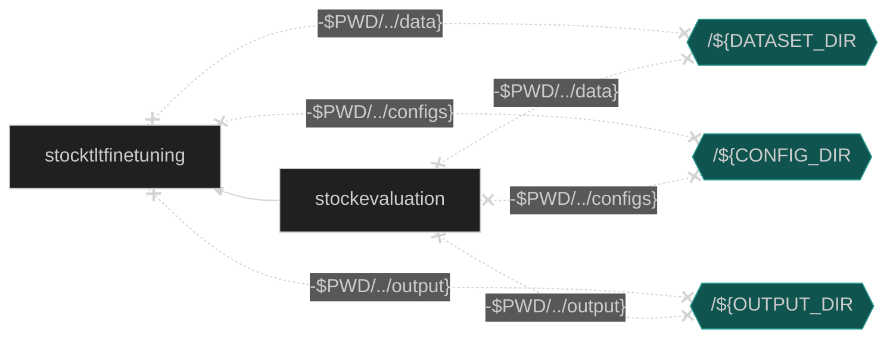
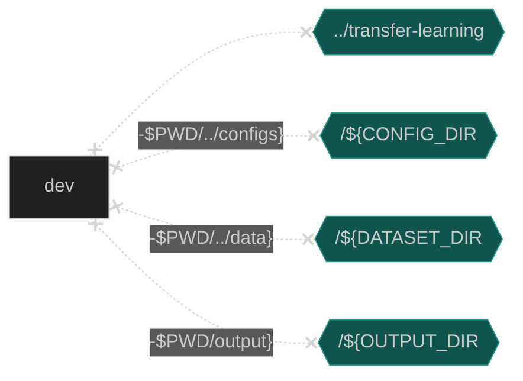

# Anomaly Detection: Visual Quality Inspection

## **Table of Contents**
- [Overview](#overview)
- [Hardware Requirements](#hardware-requirements)
- [Software Requirements](#software-requirements)
- [How it Works?](#how-it-works)
- [Get Started](#get-started)

## Overview
Add Overview

## Hardware Requirements
There are workflow-specific hardware and software setup requirements depending on how the workflow is run. Bare metal development system and Docker image running locally have the same system requirements. 

| Recommended Hardware         | Precision  |
| ---------------------------- | ---------- |
| Intel® 4th Gen Xeon® Scalable Performance processors| FP32, BF16 |
| Intel® 1st, 2nd, 3rd, and 4th Gen Xeon® Scalable Performance processors| FP32 |

## Software Requirements 
Linux OS (Ubuntu 20.04) is used in this reference solution. Make sure the following dependencies are installed.

1. `sudo apt update`
1. Python3.9, Pip/Conda and python3.9-venv
1. git

## How It Works?
Add write-up


## Get Started
### Download the Workflow Repository
Create a working directory for the reference use case and clone the [Visual Quality Inspection Workflow](https://github.com/intel/visual-quality-inspection) repository into your working directory.
```
* Remove this line in final release *
git clone https://github.com/intel-innersource/frameworks.ai.end2end-ai-pipelines.anomaly-detection-ref-use-case.git
cd frameworks.ai.end2end-ai-pipelines.anomaly-detection-ref-use-case

git clone https://github.com/intel/visual-quality-inspection
cd visual-quality-inspection
```

### Download the Transfer Learning Tool (TLT)
```
* Remove this line in final release *
git clone https://github.com/intel-innersource/frameworks.ai.transfer-learning.git
git checkout pratool/anomaly_detection

git clone https://github.com/IntelAI/transfer-learning.git

```


## Ways to run this reference use case
This reference kit offers three options for running the fine-tuning and inference processes:

- Docker
- Argo Workflows on K8s Using Helm
- Bare Metal

Details about each of these methods can be found below.

## Run Using Docker
Follow these instructions to set up and run our provided Docker image. For running on bare metal, see the [bare metal](#run-using-bare-metal) instructions.

### 1. Set Up Docker Engine and Docker Compose
You'll need to install Docker Engine on your development system. Note that while **Docker Engine** is free to use, **Docker Desktop** may require you to purchase a license. See the [Docker Engine Server installation instructions](https://docs.docker.com/engine/install/#server) for details.


To build and run this workload inside a Docker Container, ensure you have Docker Compose installed on your machine. If you don't have this tool installed, consult the official [Docker Compose installation documentation](https://docs.docker.com/compose/install/linux/#install-the-plugin-manually).


```bash
DOCKER_CONFIG=${DOCKER_CONFIG:-$HOME/.docker}
mkdir -p $DOCKER_CONFIG/cli-plugins
curl -SL https://github.com/docker/compose/releases/download/v2.7.0/docker-compose-linux-x86_64 -o $DOCKER_CONFIG/cli-plugins/docker-compose
chmod +x $DOCKER_CONFIG/cli-plugins/docker-compose
docker compose version
```

### 2. Install Vision Packages and Intel TensorFlow Toolkit
Ensure you have completed steps in the [Get Started Section](#get-started).

### 3. Set Up Docker Image
Build or Pull the provided docker image.

```bash
git submodule update --init --recursive
cd docker
docker compose build
```
OR
```bash
docker pull intel/ai-workflows:beta-anomaly-detection
docker pull intel/ai-workflows:beta-tlt-anomaly-detection
```

### 4. Preprocess Dataset with Docker Compose
Prepare dataset for Anomaly Detection workflows and accept the legal agreement to use the Intel Dataset Downloader.

```bash
cd docker
docker compose run preprocess -e USER_CONSENT=y
```

| Environment Variable Name | Default Value | Description |
| --- | --- | --- |
| DATASET_DIR | `$PWD/../data` | Unpreprocessed dataset directory |
| USER_CONSENT | n/a | Consent to legal agreement | <!-- TCE: Please help me word this better -->

### 5. Run Pipeline with Docker Compose

The Vision Finetuning container must complete successfully before the Evaluation container can begin. The Evaluation container uses the model and checkpoint files created by the vision fine-tuning container stored in the `${OUTPUT_DIR}` directory to complete the evaluation tasks.




Run entire pipeline to view the logs of different running containers.

```bash
cd docker
docker compose run stock-evaluation &
```

| Environment Variable Name | Default Value | Description |
| --- | --- | --- |
| CONFIG | `eval` | Config file name |
| CONFIG_DIR | `$PWD/../configs` | Anomaly Detection Configurations directory |
| DATASET_DIR | `$PWD/../data` | Preprocessed dataset directory |
| OUTPUT_DIR | `$PWD/../output` | Logfile and Checkpoint output |

#### View Logs
Follow logs of each individual pipeline step using the commands below:

```bash
docker compose logs stock-tlt-fine-tuning -f
```

To view inference logs
```bash
fg
```

### 6. Run One Workflow with Docker Compose
Create your own script and run your changes inside of the container or run the evaluation without waiting for fine-tuning.



Run using Docker Compose.

```bash
cd docker
docker compose run dev
```

| Environment Variable Name | Default Value | Description |
| --- | --- | --- |
| CONFIG | `eval` | Config file name |
| CONFIG_DIR | `$PWD/../configs` | Anomaly Detection Configurations directory |
| DATASET_DIR | `$PWD/../data` | Preprocessed Dataset |
| OUTPUT_DIR | `$PWD/output` | Logfile and Checkpoint output |
| SCRIPT | `anomaly_detection.py` | Name of Script |

#### Run Docker Image in an Interactive Environment

If your environment requires a proxy to access the internet, export your
development system's proxy settings to the docker environment:
```bash
export DOCKER_RUN_ENVS="-e ftp_proxy=${ftp_proxy} \
  -e FTP_PROXY=${FTP_PROXY} -e http_proxy=${http_proxy} \
  -e HTTP_PROXY=${HTTP_PROXY} -e https_proxy=${https_proxy} \
  -e HTTPS_PROXY=${HTTPS_PROXY} -e no_proxy=${no_proxy} \
  -e NO_PROXY=${NO_PROXY} -e socks_proxy=${socks_proxy} \
  -e SOCKS_PROXY=${SOCKS_PROXY}"
```

Run the workflow with the ``docker run`` command, as shown:

```bash
export CONFIG_DIR=$PWD/../configs
export DATASET_DIR=$PWD/../data
export OUTPUT_DIR=$PWD/../output
docker run -a stdout ${DOCKER_RUN_ENVS} \
           -e PYTHONPATH=/workspace/transfer-learning \
           -v /$PWD/../transfer-learning:/workspace/transfer-learning \
           -v /${CONFIG_DIR}:/workspace/configs \
           -v /${DATASET_DIR}:/workspace/data \
           -v /${OUTPUT_DIR}:/workspace/output \
           --privileged --init -it --rm --pull always --shm-size=8GB \
           intel/ai-workflows:beta-anomaly-detection \
           bash
```

Run the command below for fine-tuning and inference:
```bash
python /workspace/anomaly_detection.py --config_file /workspace/configs/finetuning.yaml
```

### 7. Clean Up Docker Containers
Stop containers created by docker compose and remove them.

```bash
docker compose down
```

## Run Using Argo Workflows on K8s Using Helm
### 1. Install Helm
- Install [Helm](https://helm.sh/docs/intro/install/)
```bash
curl -fsSL -o get_helm.sh https://raw.githubusercontent.com/helm/helm/main/scripts/get-helm-3 && \
chmod 700 get_helm.sh && \
./get_helm.sh
```
### 2. Setting up K8s
- Install [Argo Workflows](https://argoproj.github.io/argo-workflows/quick-start/) and [Argo CLI](https://github.com/argoproj/argo-workflows/releases)
- Configure your [Artifact Repository](https://argoproj.github.io/argo-workflows/configure-artifact-repository/)
- Ensure that your dataset and config files are present in your chosen artifact repository.
### 3. Install Workflow Template
```bash
export NAMESPACE=argo
helm install --namespace ${NAMESPACE} --set proxy=${http_proxy} anomaly-detection ./chart
argo submit --from wftmpl/workspace --namespace=${NAMESPACE}
```
### 4. View 
To view your workflow progress
```bash
argo logs @latest -f
```

## Expected Output
```
#### Processing ZIPPER dataset completed ########

+------------+------------------------+-------+--------------+
|  Category  | Test set (Image count) | AUROC | Accuracy (%) |
+------------+------------------------+-------+--------------+
|   BOTTLE   |           83           | 99.92 |    97.59     |
|   CABLE    |          150           | 85.55 |     80.0     |
|  CAPSULE   |          132           | 95.65 |    84.85     |
|   CARPET   |          117           | 82.78 |    71.79     |
|    GRID    |           78           | 84.71 |    83.33     |
|  HAZELNUT  |          110           |  99.5 |    96.36     |
|  LEATHER   |          124           | 100.0 |    100.0     |
| METAL_NUT  |          115           | 89.49 |    76.52     |
|    PILL    |          167           | 96.07 |    91.62     |
|   SCREW    |          160           | 34.45 |     27.5     |
|    TILE    |          117           |  95.6 |    91.45     |
| TOOTHBRUSH |           42           | 97.22 |     88.1     |
| TRANSISTOR |          100           | 93.83 |     82.0     |
|    WOOD    |           79           | 99.12 |     96.2     |
|   ZIPPER   |          151           |  96.4 |    92.05     |
+------------+------------------------+-------+--------------+
```

## Run Using Bare Metal
### 1. Create Conda Environment 
```
conda create --name hls_env python=3.9
conda activate hls_env
```


### 1. Create conda env and install software packages
   ```
   conda create -n anomaly_det_refkit python=3.9
   conda activate anomaly_det_refkit
   pip install -r requirements.txt
   ```

### 2. Create ~~conda~~ pip venv and install software packages
   ```
   #conda create -n anomaly_det_refkit python=3.9
   #conda activate anomaly_det_refkit
   python3 -m venv venv
   source venv/bin/activate
   pip install -r requirements.txt
   ```

### 4. Download and prepare the dataset

   Download the MVTEC dataset from: https://www.mvtec.com/company/research/datasets/mvtec-ad/downloads

   ```
   wget https://www.mydrive.ch/shares/38536/3830184030e49fe74747669442f0f282/download/420938113-1629952094/mvtec_anomaly_detection.tar.xz
   ```

   Extract 'mvtec_anomaly_detection.tar.xz' using following commands:
   ```
   mkdir -p mvtec
   tar -xf mvtec_anomaly_detection.tar.xz --directory data
   ```

   Generate the CSV file for each category of MVTEC dataset using following command. It will automatically place the CSV files under each category directory:
   ```
   python csv_generator_mvtec.py --path /path/to/mvtec/
   ```

### OR
   Download and pre-process the dataset using Model Zoo dataset download API
   ```
   git clone https://github.com/intel-innersource/frameworks.ai.models.intel-models.git
   git checkout wafaa/datasetapi-mvtec-dataset
   python dataset.py -n mvtec-ad --download --preprocess -d /data/datad/ad_best_testing/mvtec_dataset
   ```
   

### 5. Feature Extractor

   We have three feature extractor options.
   ```
   First - SimSiam - A self-supervised method that takes ResNet50 model as backbone and fine-tune the model on custom dataset to get better feature embedding
   ```
   Download the Sim-Siam weights based on ResNet50 model and place under simsiam directory
   ```
   wget https://dl.fbaipublicfiles.com/simsiam/models/100ep-256bs/pretrain/checkpoint_0099.pth.tar -o ./simsiam/checkpoint_0099.pth.tar
   ```
   ```
   Second - Cut-paste - A self-supervised method that takes ResNet50/ ResNet18 model as backbone and fine-tune the model on custom dataset to get better feature embedding
   ```
   ```
   Third - Pretrained - No fine-tuning and just use pretrained ResNet50/ResNet18 model for feature extraction
   ```
### 6. Running the workload with custom model

   ```
   In config.yaml, change 'fine_tune' flag to false and provide a custom model path under 'saved_model_path' 

   python anomaly_detection.py --config_file ./configs/config.yaml

   Change other settings in config.yaml to run different configurations 

   ```

### 7. Running the workload with TLT fine-tuned model

   ```
   In config.yaml, change 'fine_tune' flag to true and set the simsiam/cutpaste settings accordingly

   python anomaly_detection.py --config_file ./configs/config.yaml

   Change other settings in config.yaml to run different configurations

   ```

